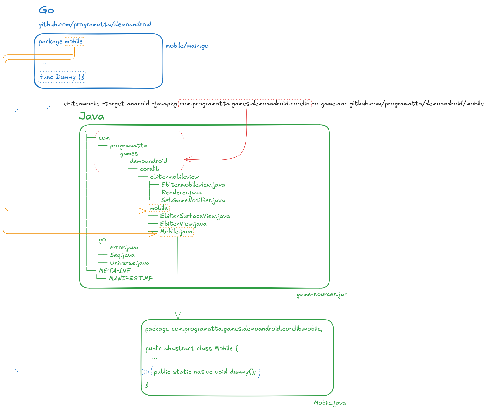

# Go + Ebiten Android Demo Project.

> ⚠️ Work in Progress: This guide is actively being improved and translated from Spanish. Feedback is welcome!

This document provides a step-by-step guide on how to build an Android application (**APK**) using **Go + Ebiten**, and generate an **.aar** library without using **Android Studio**.

> 📢 This guide is based on the tutorial by [Saffron Dionysius, Can You Really Develop Android Apps Without Android Studio?](https://medium.com/@sdiony/can-you-really-develop-android-apps-without-android-studio-cdd9b951de65)

## ✅ Requirements.

You should have the following configured in your development environment:

Tool Used | Version
----------|------------------
Golang | 1.4
Ebiten | github.com/hajimehoshi/ebiten/v2
Java SDK | 17
Android Tools | [Commandline tools](https://dl.google.com/android/repository/commandlinetools-linux-11076708_latest.zip)
Gradle | [gradle-8.14.2-bin.zip](https://services.gradle.org/distributions/gradle-8.14.2-bin.zip)

> 💡 Development was done on **Debian 12** using **VSCode** with a [**custom devcontainer**](https://github.com/programatta/devcontainers/tree/master/goebitendevcontainer) and a helper Docker container: [**go-android**](https://github.com/programatta/toolscontainers/tree/master/go-android).

## 🚀 Project Structure Overview.
The structure of the project will look like this:
```shell
.
├── bin
│   ├── android-libs      # Generated libraries (.aar, .jar)
│   └── android           # Android project (Gradle)
├── game                  # Game logic (Ebiten)
├── mobile                # Entry point for gomobile/ebitenmobile
├── go.mod
└── go.sum
```

We’ll build this structure step by step.

## 🕹️ Creating the Go Project with Ebiten.
Initialize the Go module and add Ebiten:

```bash
mkdir demoandroid
cd demoandroid
go mod init github.com/programatta/demoandroid
go get github.com/hajimehoshi/ebiten/v2
```

Create a `game` package to draw a purple screen with debug text:

```bash
mkdir game
```

In `game/game.go`:

```go
package game

import (
	"image/color"
	"github.com/hajimehoshi/ebiten/v2"
	"github.com/hajimehoshi/ebiten/v2/ebitenutil"
)

type Game struct{}

func NewGame() *Game {
  return &Game{}
}

// ----------------------------------------------------------------------------
// Implements Ebiten Game Interface
// ----------------------------------------------------------------------------
func (g *Game) Update() error { 
  return nil 
}

func (g *Game) Draw(screen *ebiten.Image) {
	screen.Fill(color.NRGBA{0xcf, 0xba, 0xf0, 0xff})
	ebitenutil.DebugPrint(screen, "Hello Android from Go!")
}

func (g *Game) Layout(outsideWidth, outsideHeight int) (int, int) {
	return outsideWidth, outsideHeight
}
```

Now the Ebiten `Game` interface is implemented. The `Draw()` function renders the purple background.

Next, we create a `mobile` package which contains the Go entry point for Android. This is where the native `.so` libraries will link from.

```bash
mkdir mobile
```

In `mobile/main.go`:

```go
package mobile

import (
	"github.com/hajimehoshi/ebiten/v2/mobile"
	"github.com/programatta/demoandroid/game"
)

func init() {
	mobile.SetGame(game.NewGame())
}

// At least one exported function is required by gomobile.
func Dummy() {}
```

Note that we do not use `ebiten.RunGame()` but instead use `mobile.SetGame()` inside an `init()` function.

At this point, the structure is:

```shell
.
├── game
│   └── game.go
├── mobile
│   └── main.go
├── go.mod
├── go.sum
└── README.md
```

## 📦 Generating the Android Library (.aar).
To generate the `.aar`, we use the `ebitenmobile` tool which builds on top of `gomobile`. Install it with:

```bash
go install github.com/hajimehoshi/ebiten/v2/cmd/ebitenmobile@latest
```

Create a directory for the output libraries:

```bash
mkdir -p bin/android-libs

```

At this point, the structure is:
~~~shell
.
├── bin
│   └── android-libs
├── game
│   └── game.go
├── mobile
│   └── main.go
├── go.mod
├── go.sum
└── README.md
~~~

Generate the `.aar`:

```bash
ebitenmobile bind -target android -javapkg com.programatta.games.demoandroid.corelib -o bin/android-libs/game.aar github.com/programatta/demoandroid/mobile
```

> ⚠️ Avoid using the same Java package name in the `.aar` and the Android project to prevent conflicts.

Output:

```shell
bin/android-libs/
├── game.aar
└── game-sources.jar
```

The `.aar` includes native `.so` libraries (arm64-v8a, armeabi-v7a, x86, x86\_64) under `jni/`, and a `classes.jar` compiled from `game-sources.jar`.

A bird's eye view of the outline process:



## 🛠️ Creating the Android Project (Gradle).
Under `bin`, create the Android directory:

```bash
mkdir bin/android
```

Project structure:

```shell
.
├── bin
│   ├── android
│   └── android-libs
│       ├── game.aar
│       └── game-sources.jar
├── game
│   └── game.go
├── mobile
│   └── main.go
├── go.mod
├── go.sum
└── README.md
```

Initialize a basic Java project with Gradle:

```bash
cd bin/android
gradle init --type java-application --dsl groovy --package com.programatta.games.demoandroid --project-name "android" --no-split-project --java-version 17 --use-defaults
```

Now, the java project structure is:
~~~shell
.
├── app
│   ├── build.gradle
│   └── src
│       ├── main
│       │   ├── java
│       │   │   └── com
│       │   │       └── programatta
│       │   │           └── games
│       │   │               └── demoandroid
│       │   │                   └── App.java
│       │   └── resources
│       └── test
│           ├── java
│           │   └── com
│           │       └── programatta
│           │           └── games
│           │               └── demoandroid
│           │                   └── AppTest.java
│           └── resources
├── gradle
│   ├── libs.versions.toml
│   └── wrapper
│       ├── gradle-wrapper.jar
│       └── gradle-wrapper.properties
├── gradle.properties
├── gradlew
├── gradlew.bat
└── settings.gradle
~~~

And we need to do some changes to transform java project to android project.

Then:

```bash
mkdir app/libs
cp ../android-libs/game.aar app/libs
```

Rename `App.java` to `MainActivity.java` and `resources` to `res`:

```bash
mv app/src/main/java/com/programatta/games/demoandroid/App.java app/src/main/java/com/programatta/games/demoandroid/MainActivity.java
mv app/src/main/resources app/src/main/res
```

Create the necessary layout and values directories:

```bash
mkdir -p app/src/main/res/layout
mkdir -p app/src/main/res/values
```

Add placeholder files:

```bash
touch app/src/main/res/layout/activity_main.xml

touch app/src/main/res/values/colors.xml

touch app/src/main/res/values/styles.xml

touch app/src/main/AndroidManifest.xml

touch app/src/main/java/com/programatta/games/demoandroid/EbitenViewWithErrorHandling.java

touch build.gradle

rm -rf app/src/test
```

Final structure:

```shell
.
├── app
│   ├── build.gradle
│   ├── libs
│   │   └── game.aar
│   └── src
│       └── main
│           ├── AndroidManifest.xml
│           ├── java
│           │   └── com
│           │       └── programatta
│           │           └── games
│           │               └── demoandroid
│           │                   ├── EbitenViewWithErrorHandling.java
│           │                   └── MainActivity.java
│           └── res
│               ├── layout
│               │   └── activity_main.xml
│               └── values
│                   ├── colors.xml
│                   └── styles.xml
├── build.gradle
├── gradle
│   ├── libs.versions.toml
│   └── wrapper
│       ├── gradle-wrapper.jar
│       └── gradle-wrapper.properties
├── gradle.properties
├── gradlew
├── gradlew.bat
└── settings.gradle
```

Now, we write or modify these files:

#### 📝 gradle.properties
~~~properties
# This file was generated by the Gradle 'init' task.
# https://docs.gradle.org/current/userguide/build_environment.html#sec:gradle_configuration_properties

org.gradle.configuration-cache=true

# Para el uso moderno de dependencias de Android (AndroidX)
android.enableJetifier=true
android.useAndroidX=true
~~~

#### 📝 build.gradle
~~~gradle
/*
 * This file was generated by the Gradle 'init' task.
 *
 * This is a general purpose Gradle build.
 * Learn more about Gradle by exploring our Samples at https://docs.gradle.org/8.14.2/samples
 */
buildscript {
  ext {
    agp_version = '8.10.1' // Versión del Android Gradle Plugin
  }
  repositories {
    google()
    mavenCentral()
  }
  dependencies {
    classpath "com.android.tools.build:gradle:$agp_version"
  }
}

allprojects {
  repositories {
    google()
    mavenCentral()
  }
}
~~~

#### 📝 app/build.gradle
~~~gradle
/*
 * This file was generated by the Gradle 'init' task.
 *
 * This generated file contains a sample Java application project to get you started.
 * For more details on building Java & JVM projects, please refer to https://docs.gradle.org/8.14.2/userguide/building_java_projects.html in the Gradle documentation.
 */

plugins {
    // Apply the application plugin to add support for building a CLI application in Java.
    id 'com.android.application'
}

android {
  namespace 'com.programatta.games.demoandroid'
  compileSdk 35
  defaultConfig {
    applicationId "com.programatta.games.demoandroid"
    minSdk 24
    targetSdk 35
    versionCode 1
    versionName "1.0"
  }

  buildTypes {
    release {
      minifyEnabled false
      proguardFiles getDefaultProguardFile('proguard-android-optimize.txt'), 'proguard-rules.pro'
    }
  }
}

dependencies {
  // Dependencias estándar de Android
  implementation 'androidx.appcompat:appcompat:1.7.0'
 
  // Here adds your AAR file!
  implementation files('libs/game.aar')
 
  // This line is needed to resolve a mysterious compilation error.
  // https://stackoverflow.com/questions/75263047/duplicate-class-in-kotlin-android
  implementation platform("org.jetbrains.kotlin:kotlin-bom:1.8.0")
}

// Apply a specific Java toolchain to ease working on different environments.
java {
  toolchain {
    languageVersion = JavaLanguageVersion.of(17)
  }
}
~~~

#### 📝 app/src/main/AndroidManifest.xml
~~~xml
<manifest xmlns:android="http://schemas.android.com/apk/res/android">
  <uses-feature android:glEsVersion="0x00020000" android:required="true" />
  <application
    android:supportsRtl="true"
    android:allowBackup="true"
    android:label="Demo Android"
    android:theme="@style/AppTheme">
    <activity 
      android:exported="true"
      android:name=".MainActivity"
      android:label="Demo Android"
      android:screenOrientation="portrait"
      android:launchMode="singleInstance">
      <intent-filter>
        <action android:name="android.intent.action.MAIN" />
        <category android:name="android.intent.category.LAUNCHER" />
      </intent-filter>
    </activity>
  </application>
</manifest>
~~~

#### 📝 app/src/main/java/com/programatta/games/demoandroid/MainActivity.java
~~~java
/*
 * This source file was generated by the Gradle 'init' task
 */
package com.programatta.games.demoandroid;

import android.os.Bundle;
import android.util.Log;
import androidx.appcompat.app.AppCompatActivity;
import go.Seq;
import com.programatta.games.demoandroid.corelib.mobile.EbitenView;


public class MainActivity extends AppCompatActivity {
  @Override
  protected void onCreate(Bundle savedInstanceState) {
    super.onCreate(savedInstanceState);
    setContentView(R.layout.activity_main);
    Seq.setContext(getApplicationContext());
  }

  @Override
  protected void onPause() {
    super.onPause();
    this.getEbitenView().suspendGame();
  }

  @Override
  protected void onResume() {
    super.onResume();
    this.getEbitenView().resumeGame();
  }

  private EbitenView getEbitenView() {
    return (EbitenView)this.findViewById(R.id.ebitenview);
  }
}
~~~

#### 📝 app/src/main/java/com/programatta/games/demoandroid/EbitenViewWithErrorHandling.java
~~~java
package com.programatta.games.demoandroid;

import android.content.Context;
import android.util.AttributeSet;
import com.programatta.games.demoandroid.corelib.mobile.EbitenView;


class EbitenViewWithErrorHandling extends EbitenView {
  public EbitenViewWithErrorHandling(Context context) {
    super(context);
  }

  public EbitenViewWithErrorHandling(Context context, AttributeSet attributeSet) {
    super(context, attributeSet);
  }

  @Override
  protected void onErrorOnGameUpdate(Exception e) {
    // You can define your own error handling e.g., using Crashlytics.
    // e.g., Crashlytics.logException(e);
    super.onErrorOnGameUpdate(e);
  }
}
~~~

#### 📝 app/src/main/layout/activity_main.xml
~~~xml
<?xml version="1.0" encoding="utf-8"?>
<RelativeLayout xmlns:android="http://schemas.android.com/apk/res/android"
  xmlns:tools="http://schemas.android.com/tools"
  android:layout_width="match_parent"
  android:layout_height="match_parent"
  android:keepScreenOn="true"
  tools:context=".MainActivity">
  <com.programatta.games.demoandroid.EbitenViewWithErrorHandling
    android:id="@+id/ebitenview"
    android:layout_width="match_parent"
    android:layout_height="match_parent"
    android:focusable="true" />
</RelativeLayout>
~~~

#### 📝 app/src/main/values/colors.xml
~~~xml
<?xml version="1.0" encoding="utf-8"?>
<resources>
  <color name="colorPrimary">#3F51B5</color>
  <color name="colorPrimaryDark">#303F9F</color>
  <color name="colorAccent">#FF4081</color>
</resources>
~~~

#### 📝 app/src/main/values/styles.xml
~~~xml
<resources>
  <!-- Base application theme. -->
  <style name="AppTheme" parent="Theme.AppCompat.Light.DarkActionBar">
    <!-- Customize your theme here. -->
    <item name="colorPrimary">@color/colorPrimary</item>
    <item name="colorPrimaryDark">@color/colorPrimaryDark</item>
    <item name="colorAccent">@color/colorAccent</item>
    <item name="windowNoTitle">true</item>
    <item name="android:windowFullscreen">true</item>
    <item name="android:windowContentOverlay">@null</item>
  </style>
</resources>
~~~

## 🧪 Compiling the APK and/or AAB.

Initialize the Gradle system:

```bash
./gradlew tasks
```

### Build the debug APK.
```bash
./gradlew assembleDebug
```

The APK will be found at **app/build/outputs/apk/debug/app-debug.apk**

### Build the release APK and/or AAB.
To build release **apks** and/or **aabs** files you must first create a **keystore** file with the **keytool** command (included with **jdk**):
```bash
keytool -genkey -v -keystore keystore_name.keystore -alias key_alias_name -keyalg RSA -keysize 2048 -validity duration_in_days
```

This process will prompt you to enter a password. This password must be store in a safe place, as it will be required to sign the **apk** and/or **aab** files.

To use the keystore file with **gradle**, you can add a file called **key.properties** in the root directory of the android project.

This file should not be added to version control:

~~~properties
storeFile=keystore_name.keystore
storePassword=secret_pasword
keyAlias=key_alias_name
keyPassword=secret_pasword
~~~

You can reference this file inside **app/build.gradle**, between the **plugins{}** and **android{}** blocks:
~~~gradle
import java.util.Properties
import java.io.FileInputStream

// Cargamos las propiedades del keystore.
def keystoreProperties = new Properties()
def keystorePropertiesFile = rootProject.file("key.properties")
if(keystorePropertiesFile.exists()){
  keystoreProperties.load(new FileInputStream(keystorePropertiesFile))
}
~~~

Inside the **android{}** block, between **defaultConfig{}** and **buildTypes{}**, add the following:
~~~gradle
signingConfigs {
  release {
    if(keystorePropertiesFile.exists()){
      storeFile file(keystoreProperties['storeFile'])
      storePassword keystoreProperties['storePassword']
      keyAlias keystoreProperties['keyAlias']
      keyPassword keystoreProperties['keyPassword']
    }
  }
}
~~~

Then, inside the **buildTypes{}** block, configure the release build:
~~~gradle
buildTypes {
  release {
    // Se habilita la firma para release.
    signingConfig signingConfigs.release
    
    minifyEnabled false
    shrinkResources false
    proguardFiles getDefaultProguardFile('proguard-android-optimize.txt'), 'proguard-rules.pro'
  }
}
~~~

And finaly, add a **bundle** block (after **buildTypes{}**) to configure **aab** generation:
To end after **buildTypes{}** section we add **bundle** section to create the **aab** file:
~~~gradle
bundle {
  language {
    enableSplit = true
  }
  density {
    enableSplit = true
  }
  abi {
    enableSplit = true
  }
}
~~~

#### 📝 app/build.gradle
~~~gradle
/*
 * This file was generated by the Gradle 'init' task.
 *
 * This generated file contains a sample Java application project to get you started.
 * For more details on building Java & JVM projects, please refer to https://docs.gradle.org/8.14.2/userguide/building_java_projects.html in the Gradle documentation.
 */

plugins {
  // Apply the application plugin to add support for building a CLI application in Java.
  id 'com.android.application'
}

import java.util.Properties
import java.io.FileInputStream

// Load keystore properties
def keystoreProperties = new Properties()
def keystorePropertiesFile = rootProject.file("key.properties")
if(keystorePropertiesFile.exists()){
  keystoreProperties.load(new FileInputStream(keystorePropertiesFile))
}

android {
  namespace 'com.programatta.games.demoandroid'
  compileSdk 35
  defaultConfig {
    applicationId "com.programatta.games.demoandroid"
    minSdk 24
    targetSdk 35
    versionCode 1
    versionName "1.0"
  }

  signingConfigs {
    release {
      if(keystorePropertiesFile.exists()){
        storeFile = file(keystoreProperties['storeFile'])
        storePassword = keystoreProperties['storePassword']
        keyAlias = keystoreProperties['keyAlias']
        keyPassword = keystoreProperties['keyPassword']
      }
    }
  }

  buildTypes {
    release {
      // Se habilita la firma para release.
      signingConfig signingConfigs.release
      
      minifyEnabled false
      shrinkResources false
      proguardFiles getDefaultProguardFile('proguard-android-optimize.txt'), 'proguard-rules.pro'
    }
  }

  bundle {
    language {
      enableSplit = true
    }
    density {
      enableSplit = true
    }
    abi {
      enableSplit = true
    }
  }
}

dependencies {
  // Dependencias estándar de Android
  implementation 'androidx.appcompat:appcompat:1.7.0'
  // ¡Aquí es donde añades tu AAR!
  implementation files('libs/game.aar')
  // This line is needed to resolve a mysterious compilation error.
  // https://stackoverflow.com/questions/75263047/duplicate-class-in-kotlin-android
  implementation platform("org.jetbrains.kotlin:kotlin-bom:1.8.0")
}

// Apply a specific Java toolchain to ease working on different environments.
java {
  toolchain {
    languageVersion = JavaLanguageVersion.of(17)
  }
}
~~~

To build the release **apk**:
```bash
cd bin/android
./gradlew clean
./gradlew assembleRelease
```

To build the release **aab**:
```shell
cd bin/android
./gradlew clean
./gradlew bundleRelease
```

* The **APK** will be found at **app/build/outputs/apk/release**.
* The **AAB** will be found at **app/build/outputs/bundle/release**.

## Running the Application on Android
After installing the generated **APK** file on your Android device or emulator, the application will display the following screen:


You can check the code for this step in the [paso-01](https://github.com/programatta/demoandroid/tree/step-01) branch.
