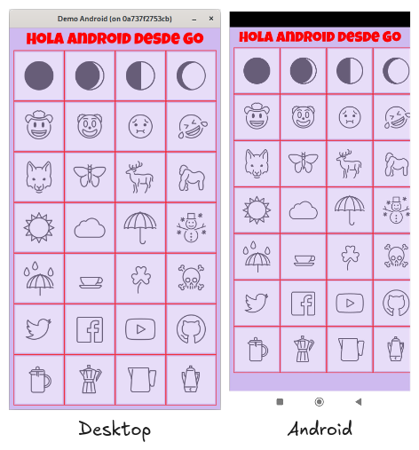
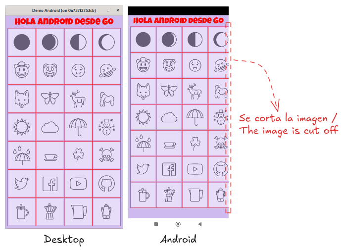
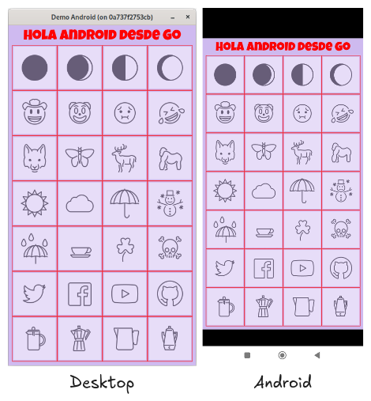

# Paso 02. Embedded resources.
In this step, we will have a set of emojis and a font embedded to be used in the demo.

The emojis were downloaded from the [OpenMoji](https://openmoji.org), project, designed by the [HfG Schwäbisch Gmünd](https://www.hfg-gmuend.de/) and licensed under [Creative Commons Attribution-ShareAlike 4.0 International (CC BY-SA 4.0)](https://creativecommons.org/licenses/by-sa/4.0/).

The font was downloaded from Google Fonts: [Luckiest Guy](https://fonts.google.com/specimen/Luckiest+Guy) designed by [Astigmatic](https://fonts.google.com/?query=Astigmatic) and licensed under [Apache 2.0](https://fonts.google.com/specimen/Luckiest+Guy/license).

## Entry point for desktop.
We will add an entry point for desktop that allows us to develop the demo without having to compile the library and **APK** for every change or tweak.

We add a **main.go** file at the root of the project:

~~~go
package main

import (
	"log"

	"github.com/hajimehoshi/ebiten/v2"
	"github.com/programatta/demoandroid/game"
)

func main() {
	ebiten.SetWindowSize(420, 760)
	ebiten.SetWindowTitle("Demo Android")

	game := game.NewGame()
	if err := ebiten.RunGame(game); err != nil {
		log.Fatal(err)
	}
}
~~~

## Preparing resources.
Inside the **game** directory, we create the **assets/fonts** and **assets/images/emojis** directories:

~~~shell
cd game
mkdir -p assets/fonts
mkdir -p assets/images/emojis
~~~ 

We place the **LuckiestGuy-Regular.ttf** file inside **assets/fonts**, and we place 28 emojis inside **assets/images/emojis**.

We create the files that will embed the resources at compile time:

~~~shell
touch assets/fonts/fonts.go
touch assets/images/images.go
~~~

### assets/fonts/fonts.go
~~~go
package fonts

import _ "embed"

//go:embed *.ttf
var FontFiles []byte
~~~

### assets/images/images.go
~~~go
package images

import (
	"embed"
)

//go:embed emojis/*.png
var EmojisDataFS embed.FS
~~~

At this point, the structure of the project is as follows:
~~~shell
.
├── bin
│   ├── android
│   │   ├── ...
│   └── android-libs
│       ├── game.aar
│       └── game-sources.jar
├── game
│   ├── assets
│   │   ├── fonts
│   │   │   ├── fonts.go
│   │   │   └── LuckiestGuy-Regular.ttf
│   │   └── images
│   │       ├── emojis
│   │       │   ├── 1F311.png
│   │       │   ├── 1F312.png
│   │       │   ├── 1F313.png
│   │       │   ├── 1F314.png
│   │       │   ├── 1F920.png
│   │       │   ├── 1F921.png
│   │       │   ├── 1F922.png
│   │       │   ├── 1F923.png
│   │       │   ├── 1F98A.png
│   │       │   ├── 1F98B.png
│   │       │   ├── 1F98C.png
│   │       │   ├── 1F98D.png
│   │       │   ├── 2600.png
│   │       │   ├── 2601.png
│   │       │   ├── 2602.png
│   │       │   ├── 2603.png
│   │       │   ├── 2614.png
│   │       │   ├── 2615.png
│   │       │   ├── 2618.png
│   │       │   ├── 2620.png
│   │       │   ├── E040.png
│   │       │   ├── E042.png
│   │       │   ├── E044.png
│   │       │   ├── E045.png
│   │       │   ├── E151.png
│   │       │   ├── E152.png
│   │       │   ├── E153.png
│   │       │   └── E154.png
│   │       └── images.go
│   └── game.go
├── go.mod
├── go.sum
├── main.go
├── mobile
│   └── main.go
└── README.md
~~~

## Adapting game.go.
We are going to add code to make use of the font and emojis to display them in a grid. To do this, we create a **utils** package under **game** to hold the logic for loading the embedded font and emoji images:

~~~shell
mkdir utils
touch utils/utils.go
~~~

### utils/utils.go
~~~go
package utils

import (
	"bytes"
	"image/color"
	"log"

	"github.com/hajimehoshi/ebiten/v2"
	"github.com/hajimehoshi/ebiten/v2/ebitenutil"
	"github.com/hajimehoshi/ebiten/v2/text/v2"
	"github.com/programatta/demoandroid/game/assets/fonts"
)

func LoadEmbeddedFont(size float64) *text.GoTextFace {
	faceSource, err := text.NewGoTextFaceSource(bytes.NewReader(fonts.FontFiles))
	if err != nil {
		log.Fatal(err)
	}

	return &text.GoTextFace{
		Source: faceSource,
		Size:   size,
	}
}

func GenerateImage(width, heigh int, emojiBytes []byte) *ebiten.Image {
	imgTmp, _, err := ebitenutil.NewImageFromReader(bytes.NewReader(emojiBytes))
	if err != nil {
		panic(err)
	}

	opTmp := &ebiten.DrawImageOptions{}
	opTmp.GeoM.Translate(float64(width)/2-float64(imgTmp.Bounds().Dx())/2, float64(heigh)/2-float64(imgTmp.Bounds().Dy())/2)

	img := ebiten.NewImage(width, heigh)
	img.Fill(color.White)
	img.DrawImage(imgTmp, opTmp)

	return img
}
~~~

Update the project dependencies from the root to include the fonts:

~~~shell
go mod tidy
~~~

We update **game/game.go** to load the font and emojis and display them on screen.

### game/game.go
~~~go
package game

import (
	"image/color"

	"github.com/hajimehoshi/ebiten/v2"
	"github.com/hajimehoshi/ebiten/v2/text/v2"
	"github.com/hajimehoshi/ebiten/v2/vector"
	"github.com/programatta/demoandroid/game/utils"
)

type Game struct {
	textFace *text.GoTextFace
	emojis   []*ebiten.Image
}

func NewGame() *Game {
	textFace := utils.LoadEmbeddedFont(32)
	emojis := utils.LoadEmojiImages()

	return &Game{
		textFace: textFace,
		emojis:   emojis,
	}
}

// ----------------------------------------------------------------------------
// Implementa Ebiten Game Interface
// ----------------------------------------------------------------------------

// Update realiza el cambio de estado si es necesario y permite procesar
// eventos y actualizar su lógica.
func (g *Game) Update() error {
	return nil
}

// Draw dibuja el estado actual.
func (g *Game) Draw(screen *ebiten.Image) {
	screen.Fill(color.NRGBA{0xcf, 0xba, 0xf0, 0xff})
	g.drawText(screen)
	g.drawEmojis(screen)
}

// Layout determina el tamaño del canvas
func (g *Game) Layout(outsideWidth, outsideHeight int) (screenWidth, screenHeight int) {
	return outsideWidth, outsideHeight
}

func (g *Game) drawText(screen *ebiten.Image) {
	messageText := "Hola Android desde Go"
	widthText, _ := text.Measure(messageText, g.textFace, 0)
	opText := &text.DrawOptions{}
	opText.GeoM.Translate(float64(screen.Bounds().Dx())/2-widthText/2, 10)
	opText.ColorScale.ScaleWithColor(color.NRGBA{0xff, 0x00, 0x00, 0xff})
	text.Draw(screen, messageText, g.textFace, opText)
}

func (g *Game) drawEmojis(screen *ebiten.Image) {
	for pos, emoji := range g.emojis {
		x := pos % 4
		y := int(pos / 4)

		emojiOp := &ebiten.DrawImageOptions{}
		emojiOp.GeoM.Translate(float64(x*101+12), float64(y*101+48))
		emojiOp.ColorScale.ScaleAlpha(0.5)
		screen.DrawImage(emoji, emojiOp)

		vector.StrokeRect(screen, float32(x*101)+9, float32(y*101)+45, 100, 100, 1, color.NRGBA{0xff, 0x00, 0x00, 0xff}, true)
	}
}
~~~

When we compile and run for both **desktop** and **Android**, we get the following output:

We can notice that part of the image is cut off:

## Improving game display.
he method responsible for determining the canvas size is **Layout**. Currently, it returns a size:
* In **desktop** via the `ebiten.SetWindowSize(420, 760)` function in **main.go**
* In **Android** based on the device's detected width and height, then scaled.

To ensure it appears the same on both **desktop** and **Android** , we will return the designed size for our game in **Layout**, which is **420** by **760**.

We create a **config** package in the root of the project and add a **config.go** file inside it:
~~~shell
mkdir config
touch config/config.go
~~~

### config/config.go
~~~go
package config

const GameWindowWidth int = 420
const GameWindowHeight int = 760
~~~

### main.go
~~~go
package main

import (
	"log"

	"github.com/hajimehoshi/ebiten/v2"
	"github.com/programatta/demoandroid/config"
	"github.com/programatta/demoandroid/game"
)

func main() {
	ebiten.SetWindowSize(config.GameWindowWidth, config.GameWindowHeight)
	ebiten.SetWindowTitle("Demo Android")

	game := game.NewGame()
	if err := ebiten.RunGame(game); err != nil {
		log.Fatal(err)
	}
}
~~~

### game/game.go
~~~go
package game

import (
  ...
  "github.com/programatta/demoandroid/config"
  ...
)
...
// Layout determina el tamaño del canvas
func (g *Game) Layout(outsideWidth, outsideHeight int) (screenWidth, screenHeight int) {
	return config.GameWindowWidth, config.GameWindowHeight
}
...
~~~

With this small change, we now have a consistent view in both  **desktop** and **Android**, as shown in the following image:

Note that we get **two black bars** for image adjustment, but we’ll see how to resolve this in the following steps.

You can check the code for this step in the [paso-02](https://github.com/programatta/demoandroid/tree/step-02) branch.
