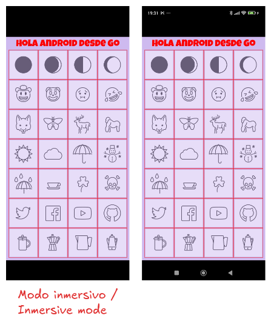
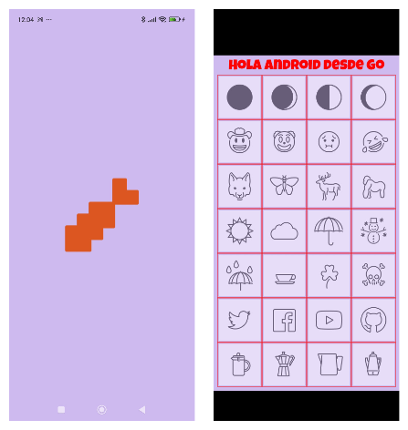

# Step 03. Immersive mode.
In this step, we’ll hide the system bars (status bar at the top and navigation bar at the bottom) by applying immersive mode. All these changes are made on the Android side.

## Changes in the Android project.
### android/app/build.gradle
~~~groovy
dependencies {
  // Dependencias estándar de Android
  ...
  implementation 'androidx.core:core:1.13.1'
  ...
}
~~~

We include androidx.core as a dependency to support older API versions and Android platform features.

### android/app/src/main/AndroidManifest.xml
We add the `android:inmersive="true"` property in the `<activity>` tag.

~~~xml
<manifest xmlns:android="http://schemas.android.com/apk/res/android">
  <uses-feature android:glEsVersion="0x00020000" android:required="true" />
  <application
    ...
  >
    <activity 
      ...
      android:immersive="true"
      ...
    >
      ...
    </activity>
  </application>
</manifest>
~~~

>🔔 **Note.**
>
>Adding `android:immersive="true"` does **not avoid** the need to write code for immersive mode. Its purpose is to declare that the activity prefers immersive mode.

### android/app/src/main/java/com/programatta/games/demoandroid/MainActivity.java
We add logic to hide the system bars and keep them hidden until the user performs a swipe gesture. We use **WindowInsetsControllerCompat** for API 30+ and **setSystemUiVisibility()** for earlier versions. Additionally, we listen for visibility changes to re-apply the flags if needed (e.g., when the keyboard appears).

~~~java
/*
 * This source file was generated by the Gradle 'init' task
 */
package com.programatta.games.demoandroid;

import android.os.Build;
...
import android.view.View;
...
import androidx.core.view.WindowCompat;
import androidx.core.view.WindowInsetsCompat;
import androidx.core.view.WindowInsetsControllerCompat;

public class MainActivity extends AppCompatActivity {
  private static final String TAG = "DemoAndroid"; 

  @Override
  protected void onCreate(Bundle savedInstanceState) {
    super.onCreate(savedInstanceState);
    setContentView(R.layout.activity_main);
    ...
    if (Build.VERSION.SDK_INT >= Build.VERSION_CODES.R) { // API 30+
      // Usamos WindowInsetsController para Android 11 (API 30) y superior
      hideSystemBarsApi30();
    } else {
      // Para APIs anteriores, seguiríamos usando setSystemUiVisibility()
      hideSystemBarsLegacy();
    }
    ...
  }
  ...

  private int hideSystemBars() {
    int uiOptions = 
      View.SYSTEM_UI_FLAG_LAYOUT_STABLE
    | View.SYSTEM_UI_FLAG_IMMERSIVE_STICKY        // Este es el flag clave para el modo "pegajoso"
    | View.SYSTEM_UI_FLAG_FULLSCREEN
    | View.SYSTEM_UI_FLAG_LAYOUT_FULLSCREEN
    | View.SYSTEM_UI_FLAG_HIDE_NAVIGATION         // Oculta la barra de navegación
    | View.SYSTEM_UI_FLAG_LAYOUT_HIDE_NAVIGATION; // Oculta la barra de estado
    return uiOptions;
  }

  //----------------------------------------------------------------------------------------------
  // Métodos para API 30+ (Android 11 y superior)
  //----------------------------------------------------------------------------------------------
  private void hideSystemBarsApi30() {
    // Get the WindowInsetsControllerCompat instance.
    // It handles the underlying platform API differences.
    WindowInsetsControllerCompat insetsController = WindowCompat.getInsetsController(getWindow(), getWindow().getDecorView());
    if (insetsController == null) {
      return;
    }

    // 1. Set the behavior for how bars reappear (sticky immersive)
    insetsController.setSystemBarsBehavior(WindowInsetsControllerCompat.BEHAVIOR_SHOW_TRANSIENT_BARS_BY_SWIPE);

    // 2. Hide the system bars using the COMPAT type
    insetsController.hide(WindowInsetsCompat.Type.systemBars());
  }

  //----------------------------------------------------------------------------------------------
  // Métodos para APIs Legacy (menos de 30)
  //----------------------------------------------------------------------------------------------
  @SuppressWarnings("deprecation") // Suprimimos la advertencia de deprecación
  private void hideSystemBarsLegacy() {
    // Establece los flags de visibilidad del sistema
    View decorView = getWindow().getDecorView();
    decorView.setSystemUiVisibility(hideSystemBars());

    // Escuchar los cambios en la visibilidad de la UI para re-aplicar los flags
    // si se pierden (ej. al aparecer el teclado).
    decorView.setOnSystemUiVisibilityChangeListener(new View.OnSystemUiVisibilityChangeListener() {
      @Override
      public void onSystemUiVisibilityChange(int visibility) {
        if ((visibility & View.SYSTEM_UI_FLAG_FULLSCREEN) == 0) {
          // Si el flag FULLSCREEN se ha limpiado, significa que la barra
          // de estado es visible. Re-aplicamos los flags.
          decorView.setSystemUiVisibility(hideSystemBars());
        }
      }
    });
  }
}
~~~

Once the APK is built and installed on the device/emulator, the app enters immersive mode using the full screen. A small swipe reveals the system bars briefly before they disappear again.

You can check the code for this step in the branch [paso-03-01](https://github.com/programatta/demoandroid/tree/paso-03-01).

## Splash screen.
When the app launches, during the time the Go runtime is loading and **Ebitengine** performs the first render, the screen briefly stays white. We can avoid this by adding a splash screen on the Android side, which shows an image immediately on startup.

To do this:
1. Add an image (PNG with transparency so it blends with the app background) to **res/drawable** (we’ll use the Ebiten logo in this demo).
2. Create a drawable definition referencing the image and background color in **res/drawable** and named  **loader_background_drawable**.
3. Create a new theme in **styles.xml** referencing the **loader_background_drawable**.
4. Add a background color (**bgColorApplication** with value **#CFBAF0**) to **colors.xml**.
5. Apply the new theme in **AndroidManifest.xml**.

~~~bash
mkdir android/app/src/main/res/drawable
touch android/app/src/main/res/drawable/loader_background_drawable.xml
~~~

### android/app/src/main/res/drawable/loader_background_drawable.xml.
~~~xml
<?xml version="1.0" encoding="utf-8"?>
<layer-list xmlns:android="http://schemas.android.com/apk/res/android">
  <item android:drawable="@color/black" />
  <item>
    <bitmap
      android:src="@drawable/ebiten"
      android:gravity="center"
      android:dither="true"/>
  </item>
</layer-list>
~~~

### android/app/src/main/res/values/styles.xml.
~~~xml
<resources>
    <!-- Base application theme. -->
    

    <!-- Splash theme -->
    
</resources>
~~~

###
~~~xml
<?xml version="1.0" encoding="utf-8"?>
<resources>
  ...
  <color name="bgColorApplication">#CFBAF0</color>
</resources>
~~~

### android/app/src/main/AndroidManifest.xml
~~~xml
<manifest xmlns:android="http://schemas.android.com/apk/res/android">
  <uses-feature android:glEsVersion="0x00020000" android:required="true" />
  <application
    ...
    android:theme="@style/SplashTheme">
    <activity 
      ...
    >
      ...
    </activity>
  </application>
</manifest>
~~~

Once the APK is compiled and installed, the app shows the splash image while loading the activity, and then enters immersive mode.

You can check the code for this step in the branch [paso-03-02](https://github.com/programatta/demoandroid/tree/paso-03-02).
