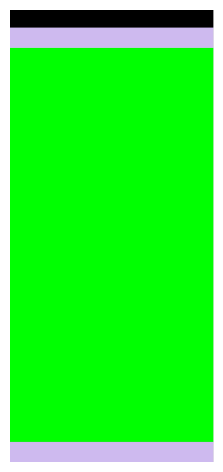
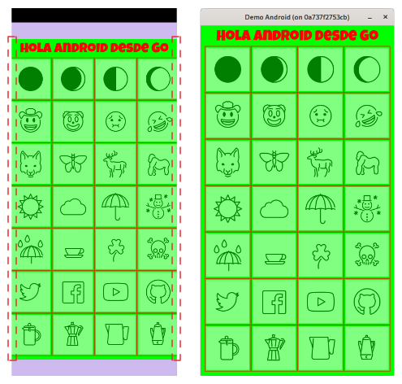
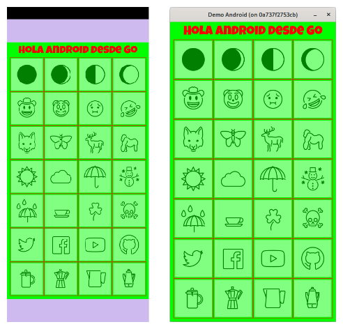
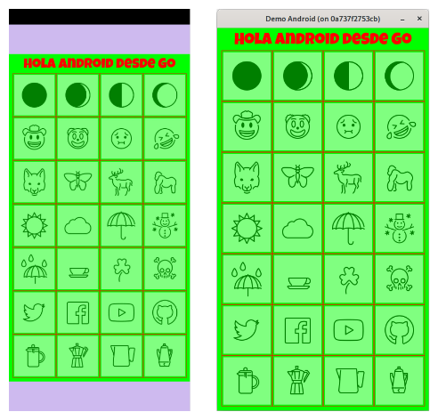
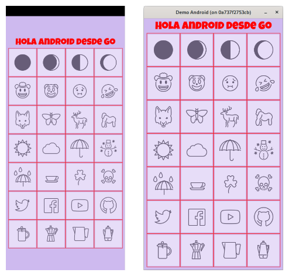
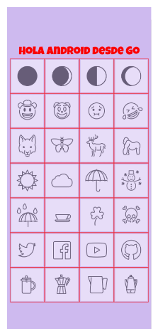

# Step 04. Removing black borders.

When the application runs, it shows black bars due to the adjustment made by **Ebitengine** when returning the logical dimensions we use to represent the game area.

We can create an intermediate image called **offscreen** with the logical dimensions of our game, and let the  `Layout()` method return the dimensions detected by the system.

In the `Draw()` method, we will clear and paint **offscreen** in green and place it centered on the screen.

### game/game.go
~~~go
package game
...
type Game struct {
  ...
  offscreen *ebiten.Image
}

func NewGame() *Game {
  ...
  offscreen := ebiten.NewImage(config.GameWindowWidth, config.GameWindowHeight)

	return &Game{
    ...
    offscreen: offscreen,
	}
}

...

// Draw dibuja el estado actual.
func (g *Game) Draw(screen *ebiten.Image) {
	screen.Fill(color.NRGBA{0xcf, 0xba, 0xf0, 0xff})

	g.offscreen.Clear()
	g.offscreen.Fill(color.NRGBA{0x00, 0xff, 0x00, 0xff})

	// g.drawText(screen)
	// g.drawEmojis(screen)

	offscreenOpt := &ebiten.DrawImageOptions{}
	offscreenOpt.GeoM.Translate(
		float64(screen.Bounds().Dx()-g.offscreen.Bounds().Dx())/2,
		float64(screen.Bounds().Dy()-g.offscreen.Bounds().Dy())/2,
	)
	screen.DrawImage(g.offscreen, offscreenOpt)
}

// Layout determina el tamaño del canvas
func (g *Game) Layout(outsideWidth, outsideHeight int) (screenWidth, screenHeight int) {
  return outsideWidth, outsideHeight
}
...
~~~

This way, we eliminate the black bars and the screen is now fully filled with the app’s background color. In the green section, we’ll render the game, so we pass the new image **g.offscreen** to the **g.drawText()** and **g.drawEmojis** functions:

### game/game.go
~~~go
package game
...
type Game struct {
  ...
  offscreen *ebiten.Image
}

func NewGame() *Game {
  ...
  offscreen := ebiten.NewImage(config.GameWindowWidth, config.GameWindowHeight)

	return &Game{
    ...
    offscreen: offscreen,
	}
}

...

// Draw dibuja el estado actual.
func (g *Game) Draw(screen *ebiten.Image) {
	screen.Fill(color.NRGBA{0xcf, 0xba, 0xf0, 0xff})

	g.offscreen.Clear()
	g.offscreen.Fill(color.NRGBA{0x00, 0xff, 0x00, 0xff})

	g.drawText(g.offscreen)
	g.drawEmojis(g.offscreen)

	offscreenOpt := &ebiten.DrawImageOptions{}
	offscreenOpt.GeoM.Translate(
		float64(screen.Bounds().Dx()-g.offscreen.Bounds().Dx())/2,
		float64(screen.Bounds().Dy()-g.offscreen.Bounds().Dy())/2,
	)
	screen.DrawImage(g.offscreen, offscreenOpt)
}

// Layout determina el tamaño del canvas
func (g *Game) Layout(outsideWidth, outsideHeight int) (screenWidth, screenHeight int) {
  return outsideWidth, outsideHeight
}
...
~~~

Now we have the game rendered in the green area, but it's overflowing beyond the screen. To fix this, we’ll scale the system-reported dimensions in the `Layout()` method relative to the game’s logical dimensions and apply them to the **offscreen** image.

This operation will be performed in the `Layout()` method.

### game/game.go
~~~go
package game
...
type Game struct {
  ...
	scaled    bool
	offscreenOpt *ebiten.DrawImageOptions
}
...
// Draw dibuja el estado actual.
func (g *Game) Draw(screen *ebiten.Image) {
	screen.Fill(color.NRGBA{0xcf, 0xba, 0xf0, 0xff})

	g.offscreen.Clear()
	g.offscreen.Fill(color.NRGBA{0x00, 0xff, 0x00, 0xff})

	g.drawText(g.offscreen)
	g.drawEmojis(g.offscreen)

	screen.DrawImage(g.offscreen, g.offscreenOpt)
}

// Layout determina el tamaño del canvas
func (g *Game) Layout(outsideWidth, outsideHeight int) (screenWidth, screenHeight int) {
	if !g.scaled {
		g.scaled = true

		scaleX := float64(outsideWidth) / float64(config.GameWindowWidth)
		scaleY := float64(outsideHeight) / float64(config.GameWindowHeight)
		scale := math.Min(scaleX, scaleY)

		g.offscreenOpt = &ebiten.DrawImageOptions{}
		g.offscreenOpt.GeoM.Scale(scale, scale)
		g.offscreenOpt.GeoM.Translate(
			(float64(outsideWidth)-float64(g.offscreen.Bounds().Dx())*scale)/2,
			(float64(outsideHeight)-float64(g.offscreen.Bounds().Dy())*scale)/2,
		)
	}
	return outsideWidth, outsideHeight
}
...
~~~

With this functionality, the game view is now centered, although the drawing appears slightly blurry. To fix this, we apply the `ebiten.FilterLinear` filter to the **g.offscreenOpt** drawing options, set in the `Layout()` method:

### game/game.go
~~~go
package game
...
// Layout determina el tamaño del canvas
func (g *Game) Layout(outsideWidth, outsideHeight int) (screenWidth, screenHeight int) {
	if !g.scaled {
		g.scaled = true

		scaleX := float64(outsideWidth) / float64(config.GameWindowWidth)
		scaleY := float64(outsideHeight) / float64(config.GameWindowHeight)
		scale := math.Min(scaleX, scaleY)

		g.offscreenOpt = &ebiten.DrawImageOptions{}
		g.offscreenOpt.GeoM.Scale(scale, scale)
		g.offscreenOpt.GeoM.Translate(
			(float64(outsideWidth)-float64(g.offscreen.Bounds().Dx())*scale)/2,
			(float64(outsideHeight)-float64(g.offscreen.Bounds().Dy())*scale)/2,
		)
    g.offscreenOpt.Filter = ebiten.FilterLinear
	}
	return outsideWidth, outsideHeight
}
...
~~~

By removing the green fill from **g.offscreen** and assigning the background color to **screen**, the app is ready.

### game/game.go
~~~go
package game
...
// Draw dibuja el estado actual.
func (g *Game) Draw(screen *ebiten.Image) {
	screen.Fill(color.NRGBA{0xcf, 0xba, 0xf0, 0xff})

	g.offscreen.Clear()
	g.offscreen.Fill(color.NRGBA{0xcf, 0xba, 0xf0, 0xff})
  ...
}
~~~

You can check the code for this step in the branch [paso-04-01](https://github.com/programatta/demoandroid/tree/paso-04-01).

## Filling the "notch" area with color.
We can see that the area where the status bar or the **notch** is located remains unpainted. To fix this, we add the attribute `android:windowLayoutInDisplayCutoutMode` to the **SplashTheme**  style defined in the **styles.xml** file. This attribute accepts values `default`, `shortEdges`, or `never`, and we assign `shortEdges`.

### android/app/src/main/res/values/styles.xml
~~~xml
<resources>
  <!-- Base application theme. -->
  

  <!-- Splash theme -->
  
</resources>
~~~

Once the APK is compiled and installed on the device or emulator, the application is displayed correctly:

> ⚠️ **Note.**
>
> One issue is that when launching the app, the icons in the **status bar** and **navigation bar** cinitially appear white. When entering immersive mode, the **status bar** icons turn black, while those in the **navigation bar** remain white, causing a strange flicker.
>
> I haven’t found a complete solution to this, except by darkening the splash screen color from **#CFBAF0** to **#7A5B9C**. With this change, the icons in both bars remain white and the flickering disappears.

You can check the code for this step in the branch [paso-04-02](https://github.com/programatta/demoandroid/tree/paso-04-02).
